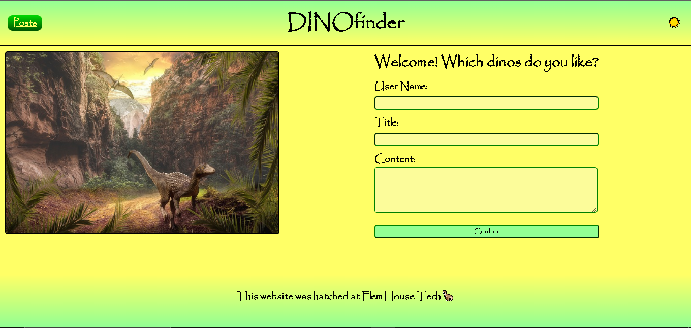

# Dino-Finder

## Description

This blogging website allows you to log information about your favorite dinos.

## Installation

Use this link that takes you to [DINOfinder](https://flem-house-dev.github.io/Dino-Finder/).

## Usage

Upon arriving at the landing page, you will see a form to fill out. Add anything you like about your favorite dinosaurs!

## Credits

* Art and concept consultation as well as content contribution was provided by my son who goes by the user name Dino_Boy.

* The dinosaur picture used on the landing page was used from [Pixabay.com](https://pixabay.com/photos/landscape-mountain-darling-clouds-3969074/) as provided by user [ELG21](https://pixabay.com/users/elg21-3764790/) under free licensing.

* Favicon was provided using [favicon.io](https://favicon.io/).

## License 

Please refer to the LICENSE in the repo.

